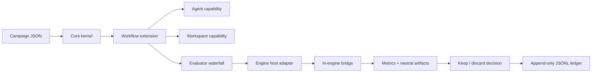

# Architecture

GameFactory is a small campaign kernel surrounded by lazy extensions. It does
not know what a browser, game engine, coding model, screenshot, or gameplay
metric is.

## Core boundary

`@gamefactory/core` owns only:

- campaign loading and validation;
- capability registration and lazy manifest discovery;
- extension lifecycle and events;
- cancellation and wall-time/experiment/crash/plateau/cost budgets;
- append-only experiment records;
- metric comparison and keep/discard decisions.

The core package has no runtime dependency outside Node.js. Manifests are read
as data; extension code is imported only when a campaign requests one of its
capabilities. This is the Pi-style constraint that keeps the factory from
turning into a universal, permanently loaded agent framework.

`@gamefactory/workflow-sdk` sits beside the kernel and contains reusable control-
plane mechanics: bounded scheduling, evaluator waterfalls, evidence preservation,
budget replay, result construction, and recovery. Workflow extensions compose
these primitives instead of independently reimplementing them.

## Capability contracts

| Kind | Responsibility |
| --- | --- |
| `workflow` | Owns the inner state machine. |
| `workspace` | Creates isolation and applies or destroys candidates. |
| `agent` | Changes only the candidate workspace. |
| `engine` | Checks, imports, builds, and exports an engine project. |
| `scenario` | Executes a domain-owned, versioned scenario. |
| `evaluator` | Produces pass/fail, metrics, violations, and artifacts. |
| `policy` | Authorizes sensitive actions or requests a human gate. |
| `reporter` | Observes events without changing decisions. |

Capabilities are addressed as `kind:id`, such as `evaluator:godot.scenario`.
An extension may contribute several closely related capabilities, but unrelated
features should be separate extensions.

## Project contracts and control loops

`@gamefactory/project-sdk` owns the durable outer production graph. A v2 project
first converges a `gamefactory.game-spec/v1` contract, then advances through
claim-addressed vertical slices. The concept remains verbatim; the frozen spec
records the playable thesis, falsifiers, decisions, and stable claim IDs. A
freeze stabilizes claims consumed by the current slice rather than fixing the
entire product forever. Runtime evidence or user direction may open a versioned
amendment between slice attempts. Amendments record their trigger, evidence,
affected claims and slices, and superseded fingerprint. Critics may propose
amendments, but only the spec owner can mutate the contract. Blockers cite
existing claims; new scope remains a non-blocking opportunity.
Claims needed by the active slice must be resolved. Future claims may remain
open so later evidence can shape them without blocking current implementation.

Each vertical slice must close a player-visible chain from input through state
change, feedback, consequence, and another decision. It declares its consumed
claims, primary risk, non-goals, mutable surface, named scenarios, interaction
trace, engine capture, and motion evidence. Accepted slices record a Git
revision and per-slice fingerprint. An unrelated spec amendment does not
invalidate a slice; changing a consumed claim or accepted dependency does.
`maximumConvergencePasses` bounds one convergence episode; it is deliberately
not a lifetime GameSpec revision ceiling.

The project runner enforces this contract. It replaces the campaign mutation
surface with the slice's mandatory `mutablePaths`, injects the full slice
contract into every agent request, and includes non-goals, gates, attempt
policy, skill content, and authority in reuse fingerprints. Evidence must cite
preserved artifacts and the current spec, approved target, runtime consumers,
and writer generations. Frozen specs are copied into immutable content-addressed
archives and amendments must supersede the latest archived revision exactly.
An agent may request the bounded spec-amendment return edge only with preserved
runtime evidence tied to a consumed claim.

Inside one spec or slice campaign, the autonomous loop remains bounded:

1. Measure the current baseline.
2. Create an isolated candidate.
3. Ask an agent for one change.
4. Run evaluators in cheapest-first order; stop on a hard failure.
5. Keep a measured improvement or destroy the candidate.
6. Append the complete record and repeat until a budget stops the campaign.

This keeps ideation and taste outside the optimizer while making repeated
implementation work scientific and reproducible.

The v1 two-phase project format remains a legacy compatibility path. New
projects use bounded spec convergence followed by player-complete slices rather
than departmental gameplay and visual phases. A tournament is not the default
ideation mechanism. Use `workflow:discovery` or `workflow:tournament`
only when a specific unresolved question has at least two genuinely different,
cheap, falsifiable hypotheses and the available evidence can discriminate
between them. Do not run whole-game or paid-asset candidates merely to create
variety. `evaluator:playtest.agents` runs synthetic behavior cohorts and
`evaluator:playtest.human` keeps actual player approval separate and explicit.

Multi-agent execution uses the same contracts. `agent.team` coordinates roles
inside one candidate, while `workflow:tournament` coordinates several isolated
candidates. Parallel work never owns acceptance: a serialized control plane
reserves budgets, journals outcomes, preserves evidence, and applies one winner.
Agent graph writers carry generations. Any mutation automatically invalidates
and reruns completed dependent writers, evidence collectors, critics, and judges;
a required node cannot approve stale output. Execution retries, creative repair
rounds, and advisor escalations are reported separately.

Every run also writes an fsync-backed phase journal. An experiment advances
through `reserved`, `candidate-created`, `agent-finished`, `evaluated`,
`evidence-preserved`, `acceptance-intent`, `applied`, `recorded`, and `cleaned`.
Journal entries carry campaign/configuration fingerprints and idempotency keys.
On restart, pre-acceptance candidates are cleaned, applied-but-unrecorded results
are completed, and an interrupted acceptance blocks for reconciliation rather
than silently repeating a potentially destructive transition.

## Artifact model

Evaluators return references, not blobs. Artifact kinds are engine-neutral:
image, video, audio, replay, telemetry, profile, test report, log, build, or
crash dump. A browser screenshot and a Godot replay can therefore coexist
without either becoming a kernel concept.

Before a candidate is removed, its evidence is copied to a content-addressed
artifact store and the SHA-256 is recorded. Rejected experiments therefore
remain auditable after their worktrees disappear.

## Godot split

The Godot extension is the host adapter. It finds/launches Godot, performs the
import gate, controls timeouts, and reads results. `addons/gamefactory` is the
in-engine bridge. It owns Godot-specific scene loading, fixed physics ticks,
input hooks, telemetry, and optional frames. Other engines should use the same
split instead of teaching the core their APIs.
