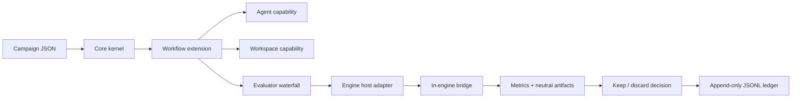

# Architecture

GameFactory is a small campaign kernel surrounded by lazy extensions. It does
not know what a browser, game engine, coding model, screenshot, or gameplay
metric is.

## Core boundary

`@gamefactory/core` owns only:

- campaign loading and validation;
- capability registration and lazy manifest discovery;
- extension lifecycle and events;
- cancellation and wall-time/experiment/crash/plateau/cost budgets;
- append-only experiment records;
- metric comparison and keep/discard decisions.

The core package has no runtime dependency outside Node.js. Manifests are read
as data; extension code is imported only when a campaign requests one of its
capabilities. This is the Pi-style constraint that keeps the factory from
turning into a universal, permanently loaded agent framework.

`@gamefactory/workflow-sdk` sits beside the kernel and contains reusable control-
plane mechanics: bounded scheduling, evaluator waterfalls, evidence preservation,
budget replay, result construction, and recovery. Workflow extensions compose
these primitives instead of independently reimplementing them.

## Capability contracts

| Kind | Responsibility |
| --- | --- |
| `workflow` | Owns the inner state machine. |
| `workspace` | Creates isolation and applies or destroys candidates. |
| `agent` | Changes only the candidate workspace. |
| `engine` | Checks, imports, builds, and exports an engine project. |
| `scenario` | Executes a domain-owned, versioned scenario. |
| `evaluator` | Produces pass/fail, metrics, violations, and artifacts. |
| `policy` | Authorizes sensitive actions or requests a human gate. |
| `reporter` | Observes events without changing decisions. |

Capabilities are addressed as `kind:id`, such as `evaluator:godot.scenario`.
An extension may contribute several closely related capabilities, but unrelated
features should be separate extensions.

## Control loops

The outer loop is human: choose or version the design intent, select a vertical
slice, approve a creative direction, define the mutable surface, acceptance
evidence, and budget. The inner loop is autonomous and bounded:

1. Measure the current baseline.
2. Create an isolated candidate.
3. Ask an agent for one change.
4. Run evaluators in cheapest-first order; stop on a hard failure.
5. Keep a measured improvement or destroy the candidate.
6. Append the complete record and repeat until a budget stops the campaign.

This keeps ideation and taste outside the optimizer while making repeated
implementation work scientific and reproducible.

`workflow:discovery` sits before this optimization loop. It ranks divergent
prototypes but defaults to recommendation-only, while `evaluator:playtest.agents`
runs synthetic behavior cohorts and `evaluator:playtest.human` keeps actual player
approval separate and explicit.

Multi-agent execution uses the same contracts. `agent.team` coordinates roles
inside one candidate, while `workflow:tournament` coordinates several isolated
candidates. Parallel work never owns acceptance: a serialized control plane
reserves budgets, journals outcomes, preserves evidence, and applies one winner.

Every run also writes an fsync-backed phase journal. An experiment advances
through `reserved`, `candidate-created`, `agent-finished`, `evaluated`,
`evidence-preserved`, `acceptance-intent`, `applied`, `recorded`, and `cleaned`.
Journal entries carry campaign/configuration fingerprints and idempotency keys.
On restart, pre-acceptance candidates are cleaned, applied-but-unrecorded results
are completed, and an interrupted acceptance blocks for reconciliation rather
than silently repeating a potentially destructive transition.

## Artifact model

Evaluators return references, not blobs. Artifact kinds are engine-neutral:
image, video, audio, replay, telemetry, profile, test report, log, build, or
crash dump. A browser screenshot and a Godot replay can therefore coexist
without either becoming a kernel concept.

Before a candidate is removed, its evidence is copied to a content-addressed
artifact store and the SHA-256 is recorded. Rejected experiments therefore
remain auditable after their worktrees disappear.

## Godot split

The Godot extension is the host adapter. It finds/launches Godot, performs the
import gate, controls timeouts, and reads results. `addons/gamefactory` is the
in-engine bridge. It owns Godot-specific scene loading, fixed physics ticks,
input hooks, telemetry, and optional frames. Other engines should use the same
split instead of teaching the core their APIs.
