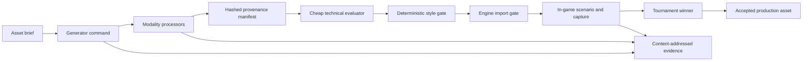

# Asset foundry

GameFactory treats asset creation as an extension workflow, not a kernel feature. The core continues to orchestrate ordinary agents, evaluators, candidates, evidence, and acceptance decisions.

## Shared protocol

`@gamefactory/asset-sdk` defines a small `gamefactory.assets/v1` protocol for every modality:

- a structured `AssetBrief` with role, prompt, output, technical requirements, and constraints;
- an `AssetGenerationRequest` passed to model-neutral commands;
- generator and processor identity, prompt, seed, source, license, and metadata;
- an `AssetManifest` containing content hashes and regeneration lineage.
- a versioned `gamefactory.style/v1` profile with canonical reference hashes and modality-specific criteria.

Supported brief modalities are `image`, `audio`, `model`, `animation`, `font`, and `other`. Supporting a modality does not force its SDK or evaluator into the core.

## Extension pipeline



`agent:asset.command` is deliberately provider-neutral. An ImageGen bridge, local diffusion process, audio service, Blender worker, or studio tool can implement the same command contract. Heavy dependencies stay in those extensions or commands.

`evaluator:asset.technical` and `evaluator:asset.style` currently handle RGBA PNGs. Additional evaluators should be layered by modality:

| Modality | Typical processors | Technical gates |
| --- | --- | --- |
| Image | alpha extraction, resize, atlas, compression | dimensions, alpha, margins, coverage, contrast |
| Audio | trim, normalize, encode, loop | duration, loudness, clipping, channels, loop seam |
| Model | convert, decimate, unwrap, material bind | scale, topology, draw calls, materials, collision |
| Animation | retarget, resample, root-motion extraction | skeleton match, duration, loop, foot sliding |
| Font | subset, atlas, hint | license, glyph coverage, atlas size, readability |

## Style profiles

A brief pins a style profile by path, ID, version, and canonical JSON SHA-256. Canonical hashing makes the identity stable across harmless whitespace and line-ending changes. The foundry verifies that identity, byte-hashes every canonical reference, and writes the complete lineage into `assets.manifest.json`. The profile is immutable during a tournament, so candidates cannot quietly rewrite the art direction used to judge them.

For images, `asset.style` can score opaque coverage, contrast, RGB channel means, red signal-color dominance, horizontal and vertical silhouette symmetry, transparent corners, and safe margin. Criteria have weights and optional ranges or target tolerances. A criterion marked `hard` fails the candidate immediately; the remaining score ranks candidates that are still on-style. Reference similarity compares the same normalized measurements against every pinned anchor.

Textual `requiredTraits` and `prohibitedTraits` are useful to generators and semantic judges, but the deterministic evaluator does not pretend it understands them. A production pipeline can add a cheap vision-model judge and an explicit human approval gate after deterministic style checks and before expensive engine scenarios.

Treat the style profile like an API:

1. Curate a small set of independent canonical anchors for silhouette, palette, material, and motion—not an ever-growing mood board.
2. Pin every anchor by SHA-256 and keep the profile immutable within a campaign.
3. Change criteria or references only with a profile version bump and a recorded re-baseline across known-good assets.
4. Do not automatically promote a tournament winner into the canonical set. Require art-direction review so iterative generation cannot slowly redefine its own target.
5. Preserve the accepted asset's profile hash and reference hashes in its manifest, making later drift auditable.

The Pulse Runner profile uses one selected generated fixture as a compact demonstration anchor. For a shipped game, replace it with independently art-directed references and add modality-specific profile sections as the project grows.

## Godot demonstration

`examples/godot/campaign.assets.json` starts from Pulse Runner's procedural fallback, runs three generated drone candidates in isolated worktrees, verifies the pinned `pulse-runner-neon@1.0.0` style pack, evaluates each PNG, imports surviving candidates into Godot, executes a deterministic scenario, captures a gameplay frame, and accepts exactly one winner.

```powershell
$env:GODOT_BINARY = "C:\path\to\godot_console.exe"
npm run smoke:godot:assets
```

Only the accepted `assets/enemies/drone.png` and `assets.manifest.json` enter the candidate revision. Source material, rejected candidates, requests, reports, and gameplay captures remain evidence.
