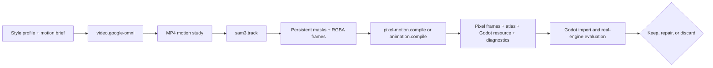

# Video-to-animation pipeline

GameFactory treats video generation, selection, segmentation, and engine assembly as separate optional capabilities. Agents may reach for this lane when it fits the hypothesis; it is not mandatory and does not replace procedural animation, hand-authored sprites, or engine-native rigs.



## Credentials

Google's API key stays outside the repository and every candidate worktree:

```powershell
npm run factory -- credentials set google.gemini
npm run factory -- credentials list
npm run factory -- credentials path
```

On Windows the stored value is encrypted for the current user with DPAPI. `GEMINI_API_KEY` is also supported and takes precedence. Traces record only the lookup name and whether resolution came from the environment or local store. Values are passed as request headers at execution time; they are not placed in request JSON, command arguments, reports, prompts, or Observatory data.

Provider credentials are distinct from a Codex subscription. Codex can orchestrate and author requests using the signed-in app server, but Google-hosted generation is billed and authenticated by Google.

## Video request

An upstream writer may create `video.request.json`:

```json
{
  "apiVersion": "gamefactory.video/v1",
  "jobs": [
    {
      "id": "rope-idle",
      "task": "image_to_video",
      "prompt": "Animate only the braided rope: a small elastic settling motion, locked camera, clean loop, no new objects.",
      "references": [{ "path": "art/rope-keyframe.png", "mediaType": "image/png" }],
      "outputPath": "art/motion/rope-idle.mp4"
    },
    {
      "id": "rope-idle-polish",
      "task": "edit",
      "previousJobId": "rope-idle",
      "prompt": "Preserve silhouette and palette; improve anticipation and make the end pose meet the first pose.",
      "outputPath": "art/motion/rope-idle-polish.mp4"
    }
  ]
}
```

`previousJobId` creates a provider conversation inside the same run. The extension records interaction IDs for provenance, but not raw provider responses or hidden reasoning. The default configured model is `gemini-omni-flash-preview`; traces label it as configured identity because the endpoint does not report a separate resolved identity.

## SAM3 tracking request

`sam3.track` reads `sam3.video.request.json` and uses persistent object IDs:

```json
{
  "apiVersion": "gamefactory.sam3.video/v1",
  "jobs": [{
    "id": "rope",
    "sourcePath": "art/motion/rope-idle-polish.mp4",
    "prompt": "the braided rope",
    "outputDirectory": "art/tracked/rope",
    "maxFrames": 240
  }]
}
```

The worker writes registered `000000.mask.png` and `000000.cutout.png` sequences. Keeping full-frame registration avoids per-frame crop wobble; the compiler calculates one union crop afterward.

On this Windows workstation the isolated runtime is
`D:\GameFactory\runtimes\sam3\venv\Scripts\python.exe`; set
`parameters.sam3.videoCommand` to that executable plus `"{worker}"`. The
current-user `HF_HOME` points to the D:-scoped gated-model cache, so a newly
started terminal or desktop process resolves the existing login without moving
the token onto C: or into the project.

## Animation compilation

For pixel-art production, prefer `pixel-motion.compile`. It adds deterministic
frame selection, area downsampling, palette locking, stable pivots, strict
clipping checks, editable normalized frames, a Godot `SpriteFrames` resource,
and `pixel-motion.quality` gates. Its request contract is documented in the
[Pixel Motion extension](../extensions/pixel-motion/README.md).

The provider-neutral `animation.compile` remains useful for non-pixel atlases
and reads `animation.request.json`:

```json
{
  "apiVersion": "gamefactory.animation/v1",
  "jobs": [{
    "id": "rope-idle",
    "sourceDirectory": "art/tracked/rope",
    "outputDirectory": "assets/animations/rope-idle",
    "frameGlob": "*.cutout.png",
    "frameStride": 2,
    "trimTransparent": true,
    "loop": true
  }]
}
```

The deterministic compiler produces `atlas.png` and `animation.json`. Diagnostics include alpha temporal jitter, centroid drift, loop-seam error, atlas dimensions, and estimated uncompressed GPU bytes. These are production gates, not proxies for fun; a later Godot scenario still evaluates readability, timing, collision alignment, and play feel in-engine.

Use `adapter: "agent-driver"` graph nodes for all three capabilities. A visual/motion director can define a motion hypothesis, these processors execute it, and a later writer creates Godot resources. A critic can request a conversational edit when the loop seam or style drifts. The expensive lane should be conditioned on a visual gap that existing assets or procedural motion cannot answer.

```json
{
  "id": "track-motion",
  "adapter": "agent-driver",
  "driver": "sam3.track",
  "role": "worker",
  "permissions": "write",
  "dependsOn": ["generate-motion"],
  "artifacts": ["art/tracked/rope"]
}
```

Equivalent nodes use drivers `video.google-omni`, `pixel-motion.compile`, or
the generic `animation.compile`. The
campaign must list those capabilities in `requires`; the
`godot-video-animation` preset contains the matching lazy extensions.

Partial generated videos, masks, logs, and reports are attached to typed failures so workflows can retain evidence instead of deleting the only useful candidate.

Provider contracts follow Google's official [Gemini Omni video guide](https://ai.google.dev/gemini-api/docs/video) and [Interactions API guide](https://ai.google.dev/gemini-api/docs/omni). Tracking follows the official [SAM3 Video Transformers API](https://huggingface.co/docs/transformers/model_doc/sam3_video).
